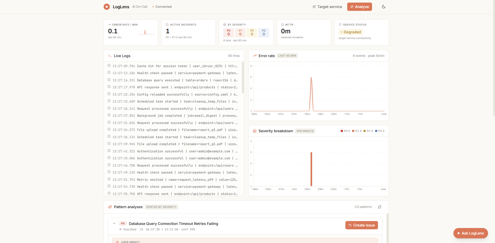
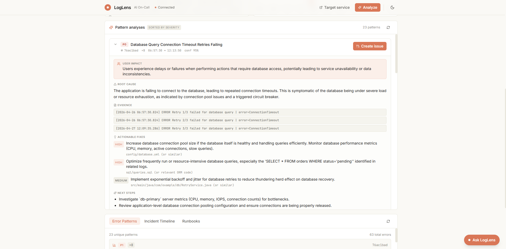
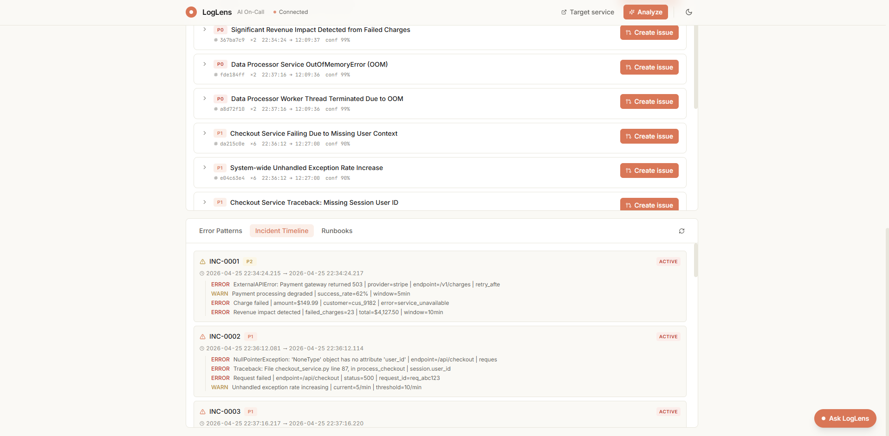
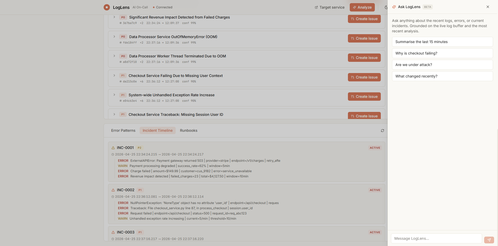
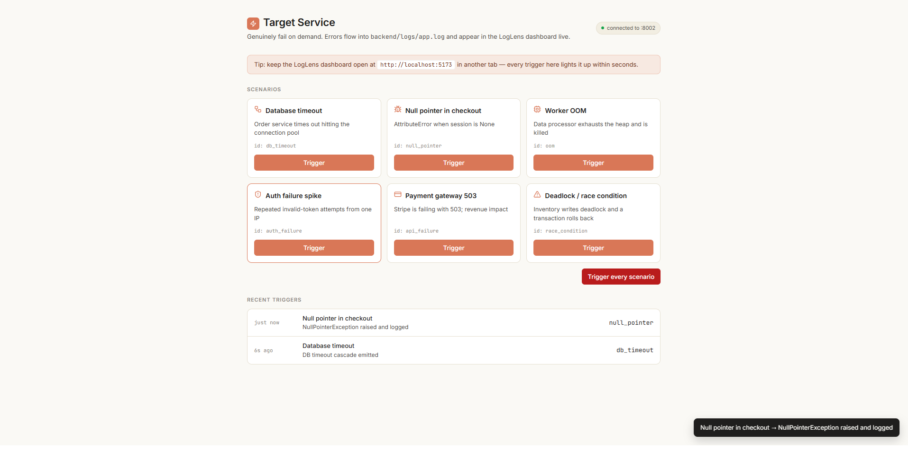

# LogLens — AI On-Call Assistant

A minimal end-to-end demo that monitors application logs, detects errors, analyzes them with an LLM, suggests actionable fixes, and creates GitHub issues suitable for assignment to GitHub Copilot Coding Agent.

## Quick Start

### 1. Backend (Python + FastAPI)

```bash
cd backend
python -m venv .venv
# Windows:
.venv\Scripts\activate
# macOS/Linux:
# source .venv/bin/activate

pip install -r requirements.txt
python main.py
```

Backend runs at **http://localhost:8001**. API docs at http://localhost:8001/docs.

### 2. Frontend (React + Vite)

```bash
cd frontend
npm install
npm run dev
```

Frontend runs at **http://localhost:5173**.

### 2b. Target Service (separate companion app)

A small companion service used to **genuinely trigger errors** that LogLens then observes. It has its own FastAPI backend on **:8002** and Vite/React frontend on **:5174**, and writes structured `ERROR` / `WARN` lines into the same `backend/logs/app.log` file LogLens tails. See [`target_service/README.md`](target_service/README.md) for setup. The LogLens dashboard no longer ships the simulate-error button — use the target service instead.

### 3. Configuration

Copy `.env.example` to `.env` in the `backend/` directory and fill in:

| Variable | Required | Description |
|----------|----------|-------------|
| `AI_API_KEY` | Optional | Google Gemini API key ([get one](https://aistudio.google.com/)) |
| `AI_MODEL` | Optional | Model name (default: `gemini-2.0-flash`; any `gemini-*` or `claude-*` model id is supported) |
| `GITHUB_TOKEN` | Optional | GitHub PAT with `repo` scope ([create one](https://github.com/settings/tokens)) |
| `GITHUB_REPO` | Optional | Target repo in `owner/repo` format |

If `AI_API_KEY` is missing, analysis and chat fall back to deterministic mock results.
If `GITHUB_TOKEN`/`GITHUB_REPO` are missing, issue creation returns a preview payload instead, and suspect-commit detection is skipped.

## Features

### Core Flow
1. **Live Logs** — LogLens tails `backend/logs/app.log`; the dashboard polls every 3 s
2. **Trigger errors from the target service** — open `:5174`, click any scenario; the target backend genuinely fails and writes structured `ERROR` / `WARN` lines into the shared log file
3. **Per-pattern analysis** — clicking **Analyze** runs ONE batched Gemini call that produces a separate structured analysis for *each* detected error pattern, with root cause, user impact, fixes, evidence, confidence, and suggested labels
4. **Create GitHub Issue per pattern** — every pattern card has its own **Create issue** button that posts a polished Phase 1-style markdown issue with an issue-metadata footer and AI-generated labels (auto-created in the repo with sensible colors)

### Anthropic / Claude UI
- Warm cream + Claude orange light theme, warm dark mode, sun/moon toggle (persisted in `localStorage`)
- Inter + JetBrains Mono typography, flat minimal cards

### Service Health Hero
A 5-card KPI strip at the top of the dashboard updated every 5 seconds:
- **Error rate / min** with a 15-minute sparkline
- **Active incidents** (P0+P1 in last 60 min)
- **Top error** template + count
- **MTTR** (mean time to recover) for resolved incidents
- **Service status** pill — `Healthy` / `Degraded` / `Down`

### Ask LogLens (chat with logs)
A right-side drawer (Claude-style bubbles) that streams responses token-by-token via SSE. Grounded on the live log buffer, the most recent analysis, and the current health summary. Falls back to a mock if `AI_API_KEY` is missing.

### Suspect Commit Detection
On every analysis, LogLens hits the GitHub API for the last 20 commits in `GITHUB_REPO` and scores each one on:
- recency,
- overlap of commit-modified files with `actionable_fixes.file_path`,
- keyword overlap between the commit message and the error.

Top suspect (score ≥ 0.35) is surfaced as a card in the Analysis panel and appended to the GitHub issue body.

### AI On-Call Tabs
- **Error Pattern Detection** — Groups similar errors by normalised template
- **Incident Timeline** — Chronological clusters with severity + status
- **Runbook Suggestions** — Maps error patterns to step-by-step remediation

## Screenshots

### Main Dashboard
Live log stream, KPI hero strip (error rate, active incidents, severity breakdown, MTTR, service status), error-rate sparkline, and the pattern-analysis panel.



### Pattern Analysis
Expanded pattern card with AI-generated root cause, user impact, evidence log lines, actionable fixes (HIGH / MEDIUM priority), and a **Create Issue** button.



### Incident Timeline
Chronological incident clusters (INC-0001 … ) with severity badge, time range, and the raw log lines that triggered each incident.



### Ask LogLens (AI Chat)
Right-side chat drawer grounded on the live log buffer and latest analysis, with suggested prompts and streaming token-by-token responses.



### Target Service
Companion app on `:5174` — pick a failure scenario (DB timeout, null pointer, OOM, auth spike, payment gateway 503, deadlock) and click **Trigger** to emit real `ERROR` / `WARN` lines into the shared log file.



## API Endpoints

| Method | Path | Description |
|--------|------|-------------|
| GET | `/health` | Health check |
| POST | `/simulate-error` | Write error to log |
| GET | `/logs/latest?n=50` | Get latest log lines |
| POST | `/analyze` | Run analysis (returns suspect commit + issue body + labels) |
| GET | `/analysis/latest` | Get cached analysis |
| POST | `/issues/create` | Create GitHub issue (auto-creates missing labels) |
| GET | `/oncall/patterns` | Error pattern detection |
| GET | `/oncall/timeline` | Incident timeline |
| GET | `/oncall/runbooks` | Runbook suggestions |
| GET | `/oncall/health-summary` | Service-health KPIs (rate, incidents, top error, MTTR, status) |
| GET | `/oncall/severity-series` | Per-minute counts split by severity (drives the two charts) |
| POST | `/oncall/analyze-patterns` | Batched per-pattern analysis (one LLM call → one card per pattern) |
| POST | `/chat` | SSE stream of an answer grounded on logs + analysis |

### Target service endpoints (`:8002`)

| Method | Path | Description |
|--------|------|-------------|
| GET | `/health` | Health check |
| GET | `/scenarios` | List of available error scenarios |
| POST | `/trigger/{scenario_id}` | Genuinely run the scenario; emits ERROR/WARN lines |
| GET | `/recent` | Recent triggers (in-memory feed) |

## Tech Stack
- **Backend**: Python 3.10+, FastAPI, Pydantic, google-generativeai, httpx
- **Frontend**: React 18, TypeScript, Vite, Tailwind CSS, Lucide icons, Recharts
- **No database**: In-memory state + file-based logs shared between LogLens and the target service
